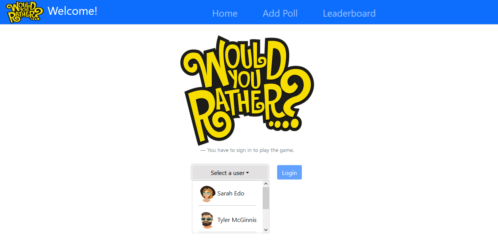
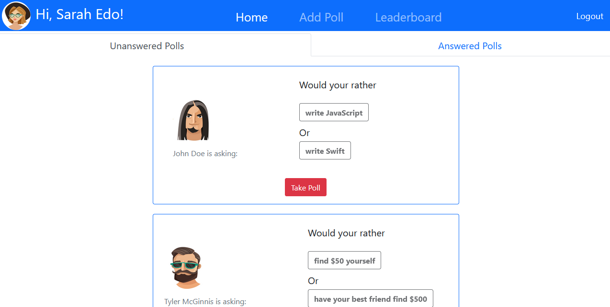
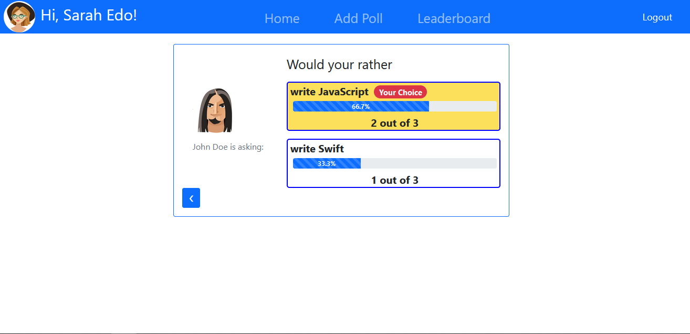
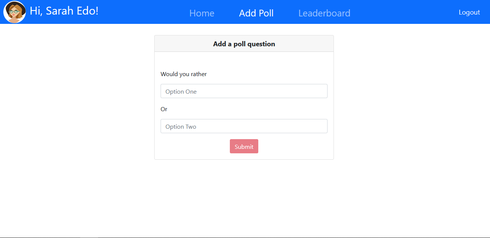
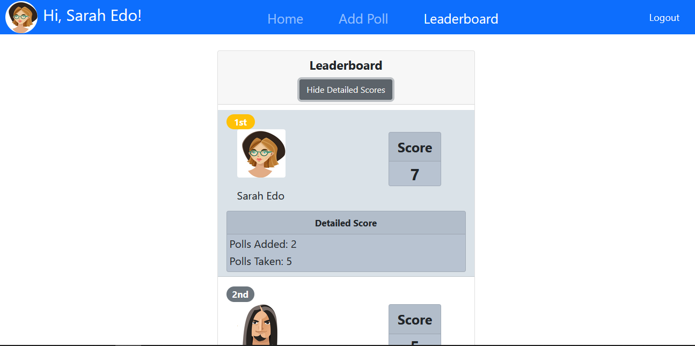

# Would you rather? game app

## Overview

This is a web app bootstrapped with Create React App and built with React and Redux where the user can play the would you rather game. The game is about answering questions with 2 options to choose from.

## Prerequisites

To get started: 
- Clone the repository by `git clone <repo>` or download the ZIP.
- Run `npm install` to install project dependenacies.
- Run `npm start` to start the developmental server.

## Description

The App is consisted of:
- Sign in page
   - Home page
      - Unanswered polls page
      - Answered polls page
   - Add poll page
   - Leaderboard page

- The user has to first sign in to view the app and play the game. If the user cicked on any item in the navigation bar or changed the url to the path of the desired page, they're asked to sign in first, then they're redirected to the desired page.

- Once the user sign in, they are first redirected to the home page (unless otherwise specified). The home page contains a navigation bar where the user can navigate adding a poll page or the leaderboard page or back to the home page.

- The home page has two tabs, one for the unanswered polls and one for the answered polls. When the user clicks on a question on the unanswered poll page, they are redirected to the the question page where they can answer the question and view the result after submitting their vote. The question is then transferred to the answered polls tab.

- If the user clicked on a question on the answered polls page, they're taken to the question page where they can view the poll details and the result, including their choice and the other users' choices.

- The user can add a poll by navigating to the Add Poll navigation link. Once the new poll is submitted, the user is redirected to the home page in the unaswered tab where they can see their added poll.

- The user can navigate to the leaderboard to see the scores, and on clicking on the show detailed scores button, they can view the detailed scores of the number of polls added and taken for each user.

- Any change in the url, will redirect the user back to the sign in page and then redirects them to the desired page. If the user enetered an unrecognized path in the url, again, they're taken to the sign in page to authenticate and then they're taken to an Error page where they can go back to the home page.

## Demo

#### Login Page

#### Home Page

#### Poll

#### Adding a Poll

#### Leaderboard Page

## Acknowledgments

https://stackoverflow.com/questions/16375592/favicon-not-showing-up-in-google-chrome

https://stackoverflow.com/questions/43454396/how-to-use-react-ref-to-get-value-from-html-select-element

https://stackoverflow.com/questions/36683770/how-to-get-the-value-of-an-input-field-using-reactjs

https://css-tricks.com/react-forms-using-refs/

https://stackoverflow.com/questions/52590903/mapstatetoprops-in-connect-must-return-a-plain-object-instead-received-unde

https://stackoverflow.com/questions/67233801/define-components-inside-tabpanel-dynamically-material-ui-react

https://stackoverflow.com/questions/55389823/how-to-fix-react-router-component-not-updating-as-route-changes

https://stackoverflow.com/questions/49152988/componentwillmount-warning

https://stackoverflow.com/questions/47314541/you-should-not-use-route-or-withrouter-outside-a-router-when-using-react-route

https://stackoverflow.com/questions/42992911/react-router-only-one-child

https://reactrouter.com/web/api/NavLink

https://stackoverflow.com/questions/53548939/react-bootstrap-centering-tabs

https://react-bootstrap.github.io/

https://stackoverflow.com/questions/56663785/invalid-hook-call-hooks-can-only-be-called-inside-of-the-body-of-a-function-com

https://reactjs.org/docs/hooks-rules.html#only-call-hooks-from-react-functions

https://stackoverflow.com/questions/24502898/show-or-hide-element-in-react

https://stackoverflow.com/questions/35420710/error-in-redux-when-executing-an-action-uncaught-type-error-cannot-read-proper

https://stackoverflow.com/questions/56842967/how-to-access-react-router-match-object-from-mapstatetoprops

https://stackoverflow.com/questions/32261441/component-does-not-remount-when-route-parameters-change

https://stackoverflow.com/questions/61937578/how-to-use-id-from-match-params-to-object-in-mapstatetoprops

https://www.tutorialrepublic.com/faq/how-to-center-buttons-in-bootstrap.php

https://dev.to/projectescape/programmatic-navigation-in-react-3p1l

https://stackoverflow.com/questions/6957443/how-to-display-div-after-click-the-button-in-javascript?noredirect=1&lq=1

https://stackoverflow.com/questions/48599660/ternary-operator-inside-map

https://stackoverflow.com/questions/54872213/ternary-operator-in-map-react

https://stackoverflow.com/questions/10526739/a-somewhat-painful-triple-nested-ternary-operator

https://stackoverflow.com/questions/32128978/react-router-no-not-found-route

https://stackoverflow.com/questions/49181678/404-page-in-react

https://stackoverflow.com/questions/45380397/scrollable-drop-down-lists-in-react-bootstrap

https://www.py4u.net/discuss/283688

https://stackoverflow.com/questions/48619733/react-router-redirect-vs-history-push

https://stackoverflow.com/questions/39288915/detect-previous-path-in-react-router

https://stackoverflow.com/questions/53803566/how-to-make-onclick-event-in-navbar-in-react

